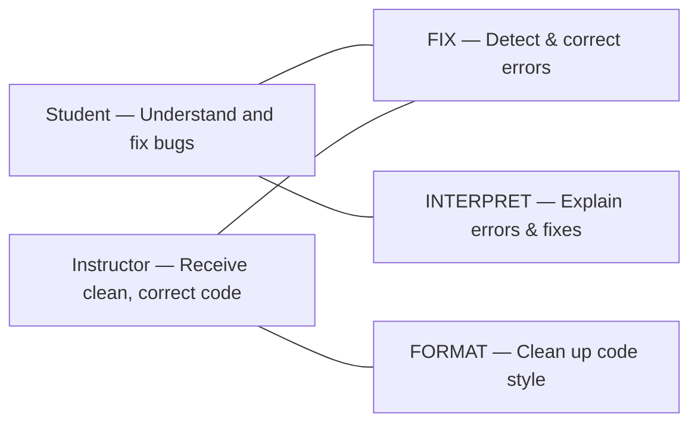
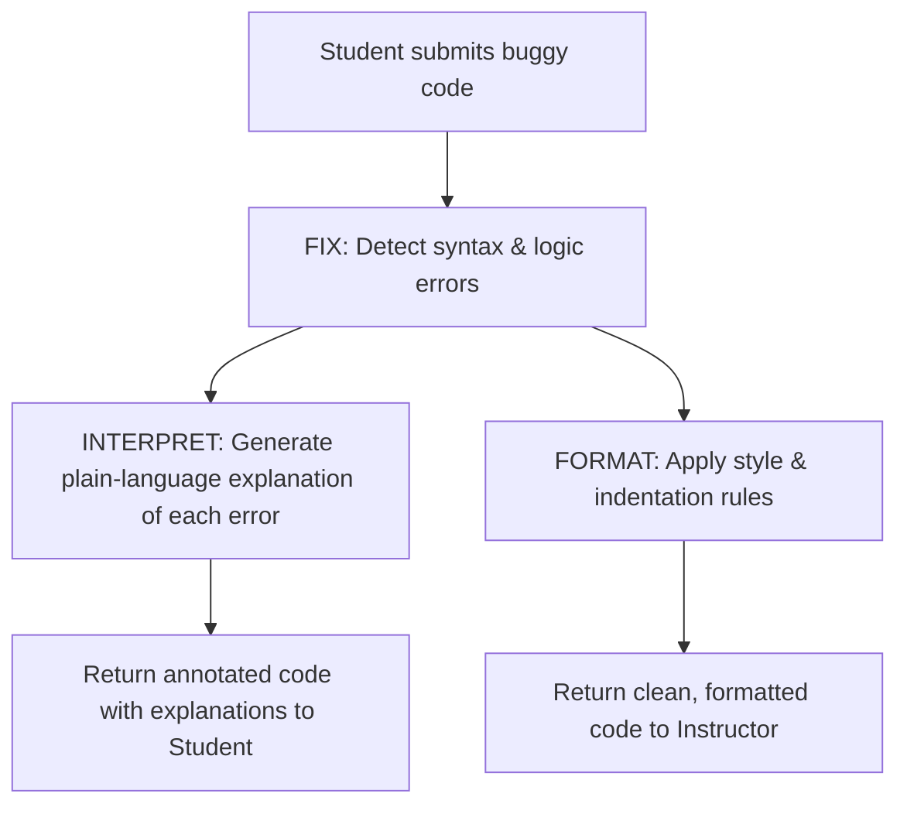

# Code Fixer — Tool Design

## Stakeholders & Needs

| Stakeholder | Need |
|---|---|
| **Student** | Needs clear explanations of bugs in their code so they can fix errors and learn from mistakes |
| **Instructor** | Needs students to submit clean, working code that follows course style guidelines |

## System Goals

| Goal | Core Function |
|---|---|
| **Goal 1** | **FIX** — Detect and correct syntax and logic errors in submitted code |
| **Goal 2** | **INTERPRET** — Explain what each error was and why the applied fix works |
| **Goal 3** | **FORMAT** — Clean up code style, indentation, and structure for readability |

## Stakeholder-to-Goal Mapping

**How to read the map:**

- The **Student's** need connects to **FIX** (get working code) and **INTERPRET** (understand *why* it was broken).
- The **Instructor's** need connects to **FIX** (students submit correct code) and **FORMAT** (submissions follow clean style guidelines).

## Process Diagram

## Summary

The **Code Fixer** tool serves two primary stakeholders. **Students** need to understand why their code is broken so they can learn from their mistakes, not just receive a corrected file. **Instructors** need students to submit clean, functional code that meets course formatting standards, reducing the time spent grading style issues.

To meet these needs, the system has three goals. **FIX** addresses both stakeholders by automatically detecting and correcting syntax and logic errors. **INTERPRET** targets the student's learning need by generating plain-language explanations of what went wrong and why the fix works. **FORMAT** targets the instructor's need by enforcing consistent code style, indentation, and structure. Together, these three functions close the loop: the student learns from annotated feedback, and the instructor receives polished submissions.

This design is tentative — for example, INTERPRET could later be split into separate "diagnose" and "teach" functions, or a **VALIDATE** goal could be added to run test cases automatically.
